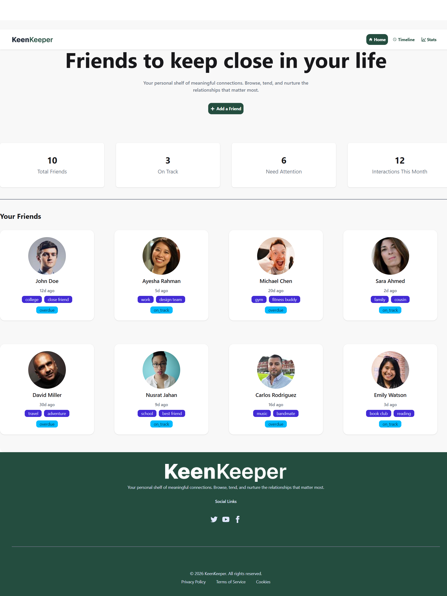

# 📊 Friends Dashboard App

## 🚀 Overview
Friends Dashboard App is a modern responsive React application that displays a list of friends with interactive data visualization. It is designed with a clean UI and optimized for all screen sizes.

🔗 Live Demo: https://friend-dashboard.netlify.app/

---

## 🖼️ Screenshot


---

## 🛠️ Tech Stack
- React.js – Frontend framework  
- React Router DOM – Page routing  
- Tailwind CSS – Styling & responsiveness  
- Recharts – Data visualization charts  
- UI Components – Reusable component system  

---

## ✨ Features
- 📱 Fully responsive design (mobile, tablet, desktop)  
- 👥 Dynamic friends list rendering  
- 📊 Interactive charts using Recharts  
- ⚡ Fast and optimized performance  
- 🧩 Reusable component architecture  

---

## 📦 Installation & Setup

```bash
# Clone the repository
git clone https://github.com/Abdur-Rahim-web/Keen-Keeper.git

# Navigate into project directory
cd Keen-Keeper

# Install dependencies
npm install

# Start development server
npm run dev
